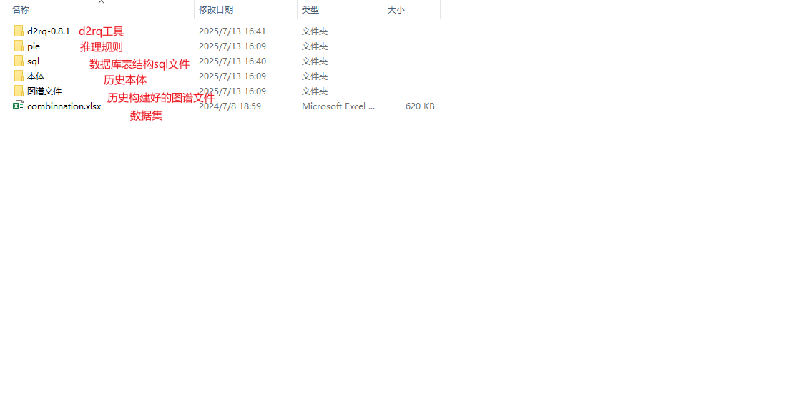
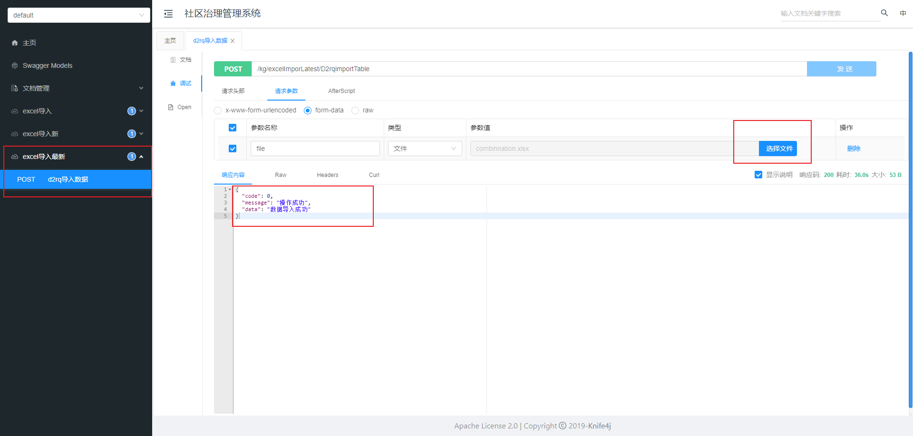
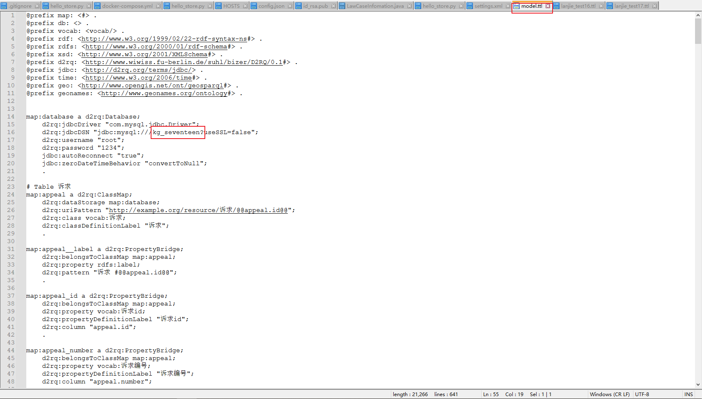

# 知识图谱构建项目

本项目通过结构化流程，将原始数据转化为知识图谱，支持数据的可视化、查询与推理。适用于需要将关系型数据库数据映射为RDF知识图谱，并在GraphDB等平台进行管理和分析的场景。

---

## 目录

- [1. 图谱构建](#1图谱构建)
  - [1.1 通过java代码生成数据库文件](#11通过java代码生成数据库文件)
  - [1.2 根据数据库文件生成图谱文件](#12根据数据库文件生成图谱文件)
  - [1.3 导入到graphDb](#13导入到graphdb)
  - [1.4 sparql语句执行](#14sparql语句执行)
  - [1.5 规则导入](#15规则导入)
  - [1.6 常见查询](#16常见查询)
  - [1.7 部分结果展示](#17-部分结果展示)
- [参考知识](#参考知识)

---

# 1、图谱构建

**文件目录**

##  1.1、通过java代码生成数据库文件

> 1）导入数据库  
> 2）运行java程序【访问 http://localhost:8081/kg/doc.html】



3）基于文档数据到数据库

## 1.2 根据数据库文件生成图谱文件

**[数据库结构没有修改直接进行1.2.3]**

### 1.2.1 生成映射文件

在 d2rq 目录下输入如下命令（路径注意修改）：

```vue
.\generate-mapping -u root -p 1234 -o lanjie_test16.ttl jdbc:mysql:///kg_sixteen?useSSL=false
```

### 1.2.2 修改映射文件

1）修改时间地点信息。

```vue
./file/修改时间地点信息.txt
```


2）修改前后缀

```vue
./file/修改前后缀.txt
```


3)映射文件

```
./file/映射文件.txt
```


### 1.2.3 生成三元组文件

数据库结构没有变的 修改下model.ttl中的数据库名



**执行生成图谱文件**

```vue
.\dump-rdf -o lanjie_test16.nt  -b http://example.org/resource/  lanjie_test16.ttl
```

## 1.3、导入到graphDb

1.3.1创建仓库


1.3.2 导入数据


## 1.4、sparql语句执行

**都需要执行**

#### 创建ex:实体隐患 和创建ex:风险事件

```vue
PREFIX rdf: <http://www.w3.org/1999/02/22-rdf-syntax-ns#>
PREFIX rdfs: <http://www.w3.org/2000/01/rdf-schema#>
PREFIX ex: <http://example.org/resource/>
PREFIX vocab: <http://example.org/resource/vocab/>
INSERT {
       vocab:实体隐患 rdf:type rdfs:Class ;
rdfs:label "实体隐患" .
       vocab:风险事件 rdf:type rdfs:Class ;
rdfs:label "风险事件" 
}
WHERE {
# 插入三元组的操作，不需要特定的 WHERE 子句
}
```


#### 创建新节点 实体隐患，确保格式与现有节点一致

```vue
PREFIX rdf: <http://www.w3.org/1999/02/22-rdf-syntax-ns#>
PREFIX vocab: <http://example.org/resource/vocab/>
PREFIX ex: <http://example.org/resource/>
PREFIX geo: <http://www.opengis.net/ont/geosparql#>
INSERT {
?entity_hazard vocab:有隐患 ?hazard .
?entity_hazard vocab:有实体 ?entity .
}
WHERE {
?appeal vocab:包含隐患 ?hazard .
?appeal vocab:包含实体 ?entity .

# 创建新节点 entity_hazard，确保格式与现有节点一致
BIND(IRI(CONCAT("http://example.org/resource/实体隐患/", STRUUID())) AS ?entity_hazard)
}
```

#### 创建新节点 风险事件，确保格式与现有节点一致

```vue
PREFIX rdf: <http://www.w3.org/1999/02/22-rdf-syntax-ns#>
PREFIX vocab: <http://example.org/resource/vocab/>
PREFIX ex: <http://example.org/resource/>
PREFIX geo: <http://www.opengis.net/ont/geosparql#>
INSERT {
?risk_event vocab:有风险 ?risk .
?risk_event vocab:有事件 ?event .
}
WHERE {
?appeal vocab:包含风险 ?risk .
?appeal vocab:包含事件 ?event .
# 创建新节点 risk_event，确保格式与现有节点一致
BIND(IRI(CONCAT("http://example.org/resource/风险事件/", STRUUID())) AS ?risk_event)

}
```


#### 插入季节（春、夏、秋、冬）：

```vue
PREFIX vocab: <http://example.org/resource/vocab/>
PREFIX time: <http://www.w3.org/2006/time#>
PREFIX xsd: <http://www.w3.org/2001/XMLSchema#>

# 将时间节点归入春天
INSERT {
  ?timeNode vocab:所属季节 vocab:春天 .
}
WHERE {
  ?timeNode time:inXSDDateTime ?dateTime .
  BIND (MONTH(?dateTime) AS ?month)
  FILTER (?month >= 3 && ?month <= 5)
}
PREFIX vocab: <http://example.org/resource/vocab/>
PREFIX time: <http://www.w3.org/2006/time#>
PREFIX xsd: <http://www.w3.org/2001/XMLSchema#>

INSERT {
  ?timeNode vocab:所属季节 vocab:夏天 .
}
WHERE {
  ?timeNode time:inXSDDateTime ?dateTime .
  BIND (MONTH(?dateTime) AS ?month)
  FILTER (?month >= 6 && ?month <= 8)
}
PREFIX vocab: <http://example.org/resource/vocab/>
PREFIX time: <http://www.w3.org/2006/time#>
PREFIX xsd: <http://www.w3.org/2001/XMLSchema#>

INSERT {
  ?timeNode vocab:所属季节 vocab:秋天 .
}
WHERE {
  ?timeNode time:inXSDDateTime ?dateTime .
  BIND (MONTH(?dateTime) AS ?month)
  FILTER (?month >= 9 && ?month <= 11)
}
PREFIX vocab: <http://example.org/resource/vocab/>
PREFIX time: <http://www.w3.org/2006/time#>
PREFIX xsd: <http://www.w3.org/2001/XMLSchema#>

INSERT {
  ?timeNode vocab:所属季节 vocab:冬天 .
}
WHERE {
  ?timeNode time:inXSDDateTime ?dateTime .
  BIND (MONTH(?dateTime) AS ?month)
  FILTER (?month = 12 || ?month <= 2)
}
```


## 1.5、规则导入

**注意文件pip路径**


#### **导入规则**

```plain
prefix sys: <http://www.ontotext.com/owlim/system#>
INSERT DATA {
    _:b sys:addRuleset <file:c:/Users/Admin/Desktop/2025-3-23/pie/all.pie>
}
```


#### **设置默认规则**

```plain
prefix sys: <http://www.ontotext.com/owlim/system#>
INSERT DATA {
    _:b sys:defaultRuleset "all"
}
```


#### **加载规则**

```
prefix sys: <http://www.ontotext.com/owlim/system#>
INSERT DATA { [] <http://www.ontotext.com/owlim/system#reinfer> [] }
```


## 1.6、常见查询

**类型查询**

```vue
PREFIX rdf: <http://www.w3.org/1999/02/22-rdf-syntax-ns#>
PREFIX vocab: <http://example.org/resource/vocab/>
PREFIX ex: <http://example.org/resource/>
PREFIX gn: <http://www.geonames.org/ontology#>
SELECT  ?s ?p ?o
WHERE {
  ?s vocab:导致 ?o .
  ?s ?p ?o .
  FILTER (isIRI(?s) && !regex(str(?s), "^file:///"))  # 确保主语不是 file URI
}
```

**实例查询**

```vue
PREFIX rdf: <http://www.w3.org/1999/02/22-rdf-syntax-ns#>
PREFIX vocab: <http://example.org/resource/vocab/>
PREFIX ex: <http://example.org/resource/>
PREFIX rdfs: <http://www.w3.org/2000/01/rdf-schema#>
SELECT DISTINCT ?s ?p ?o
WHERE {
  ?s rdf:type vocab:实体隐患 .  # 替换 ex:YourType 为您想要的具体类型
#  ?s rdf:type rdfs:Class .  # 替换 ex:YourType 为您想要的具体类型  
  ?s ?p ?o . 
  FILTER (isIRI(?s) && !regex(str(?s), "^file:///"))  # 确保主语不是 file URI
}
limit 10
```

**查询实体隐患**

```vue
PREFIX rdf: <http://www.w3.org/1999/02/22-rdf-syntax-ns#>
PREFIX vocab: <http://example.org/resource/vocab/>
PREFIX ex: <http://example.org/resource/>
PREFIX geo: <http://www.opengis.net/ont/geosparql#>
select ?entity_hazard
WHERE {
    ?entity_hazard vocab:has_hazard ?hazard .
    ?entity_hazard vocab:has_entity ?entity .
}
```

**查询风险事件**

```vue
PREFIX rdf: <http://www.w3.org/1999/02/22-rdf-syntax-ns#>
PREFIX vocab: <http://example.org/resource/vocab/>
PREFIX ex: <http://example.org/resource/>
PREFIX geo: <http://www.opengis.net/ont/geosparql#>
select ?appeal_hazard 
WHERE {
    ?appeal_hazard vocab:has_event ?event .
    ?appeal_hazard vocab:has_risk ?risk .
}
```

**查询继承关系**

```vue
PREFIX rdfs: <http://www.w3.org/2000/01/rdf-schema#>
PREFIX vocab: <http://example.org/resource/vocab/>

# 查询所有继承自ex:hasAddress的关系
SELECT ?subProperty
WHERE {
  ?subProperty rdfs:subPropertyOf vocab:conduct .
}
```


