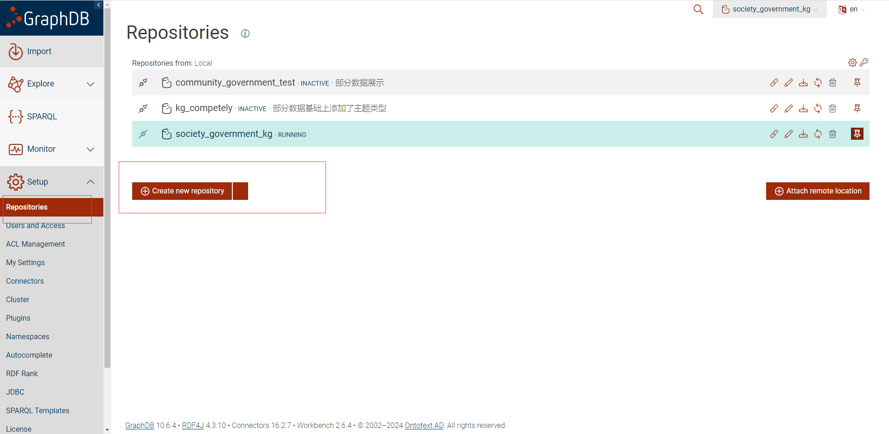

# 1、图谱构建

## 1.1、通过java代码生成数据库文件

运行kg服务 打开swagger文档导入excel


test是50条从合并中获取的


## 1.2 生成表结构并配置数据库表

sql存放在 sql文件夹的kg中


设置数据库


## 1.2根据数据库文件生成图谱文件

### 1.2.1生成映射文件

```vue
.\generate-mapping -u root -p 1234 -o lanjie_test16.ttl jdbc:mysql:///kg_sixteen?useSSL=false
```

### 1.2.2基于已有的ttl文件修改（推荐）【改完直接看1.2.4】

由于数据库结构都一样（没变动情况下）可以直接用模板ttl【model.ttl】修改生成nt文件



修改成1.1的数据库名


### 1.2.3修改映射文件【如果数据库变动了，使用这种方式（如果还不行自己了解原理去修改）】

1）修改时间地点信息。

```vue
@prefix time: <http://www.w3.org/2006/time#> .
@prefix geo: <http://www.opengis.net/ont/geosparql#> .
@prefix geonames: <http://www.geonames.org/ontology#> .
Time：
# Table time
map:time a d2rq:ClassMap;
d2rq:dataStorage map:database;
d2rq:uriPattern "time/@@time.id|urlify@@";
d2rq:class vocab:time;
d2rq:classDefinitionLabel "time";
.
map:time__label a d2rq:PropertyBridge;
d2rq:belongsToClassMap map:time;
d2rq:property rdfs:label;
d2rq:pattern "time #@@time.id@@";
.
map:time_id a d2rq:PropertyBridge;
d2rq:belongsToClassMap map:time;
d2rq:property vocab:time_id;
d2rq:propertyDefinitionLabel "time id";
d2rq:column "time.id";
.

map:time_occurred_at a d2rq:PropertyBridge;
d2rq:belongsToClassMap map:time;
d2rq:property time:inXSDDateTime;
d2rq:propertyDefinitionLabel "time occurred_at";
d2rq:column "time.occurred_at";
d2rq:datatype xsd:dateTime;
.

map:time_start_time a d2rq:PropertyBridge;
d2rq:belongsToClassMap map:time;
d2rq:property time:hasBeginning;
d2rq:propertyDefinitionLabel "time start_time";
d2rq:column "time.start_time";
d2rq:datatype xsd:dateTime;
.
map:time_end_time a d2rq:PropertyBridge;
d2rq:belongsToClassMap map:time;
d2rq:property time:hasEnd;
d2rq:propertyDefinitionLabel "time end_time";
d2rq:column "time.end_time";
d2rq:datatype xsd:dateTime;
.


Location:
# Table location
map:location a d2rq:ClassMap;
d2rq:dataStorage map:database;
d2rq:uriPattern "location/@@location.id|urlify@@";
d2rq:class vocab:location;
d2rq:classDefinitionLabel "location";
.
map:location__label a d2rq:PropertyBridge;
d2rq:belongsToClassMap map:location;
d2rq:property rdfs:label;
d2rq:pattern "location #@@location.id@@";
.
map:location_id a d2rq:PropertyBridge;
d2rq:belongsToClassMap map:location;
d2rq:property vocab:location_id;
d2rq:propertyDefinitionLabel "location id";
d2rq:column "location.id";
.
map:location_location a d2rq:PropertyBridge;
d2rq:belongsToClassMap map:location;
d2rq:property geonames:name;
d2rq:propertyDefinitionLabel "location location";
d2rq:column "location.location";
.
map:location_latitude a d2rq:PropertyBridge;
d2rq:belongsToClassMap map:location;
d2rq:property geonames:lat;
d2rq:propertyDefinitionLabel "location latitude";
d2rq:column "location.latitude";
d2rq:datatype xsd:double;
.
map:location_longitude a d2rq:PropertyBridge;
d2rq:belongsToClassMap map:location;
d2rq:property geonames:long;
d2rq:propertyDefinitionLabel "location longitude";
d2rq:column "location.longitude";
d2rq:datatype xsd:double;
.

在映射中添加owl-time的时间属性 time:inXSDDateTime  time:hasBeginning time:hasEnd

geonames:name geo:lat location.longitude
```


2）修改前后缀

```vue
1)将uriPattern " 替换成uriPattern "http://example.org/resource/
并且加上前缀：@prefix ex: <http://example.org/resource/> .
2)删除|urlify;
d2rq:uriPattern "http://example.org/resource/consequences/@@consequences.id|urlify@@";
d2rq:uriPattern "http://example.org/resource/consequences/@@consequences.id@@";
3）修改映射关系
```


3)映射文件

```vue
@prefix map: <#> .
@prefix db: <> .
@prefix vocab: <vocab/> .
@prefix rdf: <http://www.w3.org/1999/02/22-rdf-syntax-ns#> .
@prefix rdfs: <http://www.w3.org/2000/01/rdf-schema#> .
@prefix xsd: <http://www.w3.org/2001/XMLSchema#> .
@prefix d2rq: <http://www.wiwiss.fu-berlin.de/suhl/bizer/D2RQ/0.1#> .
@prefix jdbc: <http://d2rq.org/terms/jdbc/> .
@prefix time: <http://www.w3.org/2006/time#> .
@prefix geo: <http://www.opengis.net/ont/geosparql#> .
@prefix geonames: <http://www.geonames.org/ontology#> .


map:database a d2rq:Database;
	d2rq:jdbcDriver "com.mysql.jdbc.Driver";
	d2rq:jdbcDSN "jdbc:mysql:///kg_sixteen?useSSL=false";
	d2rq:username "root";
	d2rq:password "1234";
	jdbc:autoReconnect "true";
	jdbc:zeroDateTimeBehavior "convertToNull";
	.

# Table 诉求
map:appeal a d2rq:ClassMap;
    d2rq:dataStorage map:database;
    d2rq:uriPattern "http://example.org/resource/诉求/@@appeal.id@@";
    d2rq:class vocab:诉求;
    d2rq:classDefinitionLabel "诉求";
    .

map:appeal__label a d2rq:PropertyBridge;
    d2rq:belongsToClassMap map:appeal;
    d2rq:property rdfs:label;
    d2rq:pattern "诉求 #@@appeal.id@@";
    .

map:appeal_id a d2rq:PropertyBridge;
    d2rq:belongsToClassMap map:appeal;
    d2rq:property vocab:诉求id;
    d2rq:propertyDefinitionLabel "诉求id";
    d2rq:column "appeal.id";
    .

map:appeal_number a d2rq:PropertyBridge;
    d2rq:belongsToClassMap map:appeal;
    d2rq:property vocab:诉求编号;
    d2rq:propertyDefinitionLabel "诉求编号";
    d2rq:column "appeal.number";
    .

map:appeal_type1 a d2rq:PropertyBridge;
    d2rq:belongsToClassMap map:appeal;
    d2rq:property vocab:诉求主题类型一;
    d2rq:propertyDefinitionLabel "诉求主题类型一";
    d2rq:column "appeal.type1";
    .

map:appeal_type2 a d2rq:PropertyBridge;
    d2rq:belongsToClassMap map:appeal;
    d2rq:property vocab:诉求主题类型二;
    d2rq:propertyDefinitionLabel "诉求主题类型二";
    d2rq:column "appeal.type2";
    .

map:appeal_type3 a d2rq:PropertyBridge;
    d2rq:belongsToClassMap map:appeal;
    d2rq:property vocab:诉求主题类型三;
    d2rq:propertyDefinitionLabel "诉求主题类型三";
    d2rq:column "appeal.type3";
    .


map:appeal_to_collaboration_network__link a d2rq:PropertyBridge;
	d2rq:belongsToClassMap map:appeal;
	d2rq:property vocab:包含协作网络;
	d2rq:refersToClassMap map:collaboration_network;
	d2rq:join "appeal_to_collaboration_network.appeal_id => appeal.id";
	d2rq:join "appeal_to_collaboration_network.network_id => collaboration_network.id";
	.

# Table appeal_to_collaboration_network_activity (n:m)
map:appeal_to_collaboration_network_activity__link a d2rq:PropertyBridge;
	d2rq:belongsToClassMap map:appeal;
	d2rq:property vocab:包含协作网络活动;
	d2rq:refersToClassMap map:collaboration_network_activity;
	d2rq:join "appeal_to_collaboration_network_activity.activity_id => collaboration_network_activity.id";
	d2rq:join "appeal_to_collaboration_network_activity.appeal_id => appeal.id";
	.


# Table appeal_to_consequence (n:m)
map:appeal_to_consequence__link a d2rq:PropertyBridge;
	d2rq:belongsToClassMap map:appeal;
	d2rq:property vocab:包含后果;
	d2rq:refersToClassMap map:consequence;
	d2rq:join "appeal_to_consequence.appeal_id => appeal.id";
	d2rq:join "appeal_to_consequence.consequence_id => consequence.id";
	.

# Table appeal_to_entity (n:m)
map:appeal_to_entity__link a d2rq:PropertyBridge;
	d2rq:belongsToClassMap map:appeal;
	d2rq:property vocab:包含实体;
	d2rq:refersToClassMap map:entity;
	d2rq:join "appeal_to_entity.entity_id => entity.id";
	d2rq:join "appeal_to_entity.appeal_id => appeal.id";
	.

# Table appeal_to_event (n:m)
map:appeal_to_event__link a d2rq:PropertyBridge;
	d2rq:belongsToClassMap map:appeal;
	d2rq:property vocab:包含事件;
	d2rq:refersToClassMap map:event;
	d2rq:join "appeal_to_event.appeal_id => appeal.id";
	d2rq:join "appeal_to_event.event_id => event.id";
	.

# Table appeal_to_hazard (n:m)
map:appeal_to_hazard__link a d2rq:PropertyBridge;
	d2rq:belongsToClassMap map:appeal;
	d2rq:property vocab:包含隐患;
	d2rq:refersToClassMap map:hazard;
	d2rq:join "appeal_to_hazard.hazard_id => hazard.id";
	d2rq:join "appeal_to_hazard.appeal_id => appeal.id";
	.

# Table appeal_to_location (n:m)
map:appeal_to_location__link a d2rq:PropertyBridge;
	d2rq:belongsToClassMap map:appeal;
	d2rq:property vocab:所在地;
	d2rq:refersToClassMap map:location;
	d2rq:join "appeal_to_location.appeal_id => appeal.id";
	d2rq:join "appeal_to_location.location_id => location.id";
	.


#参与者—地点	
# Table participant_to_location (n:m)
map:participant_to_location__link a d2rq:PropertyBridge;
	d2rq:belongsToClassMap map:participant;
	d2rq:property vocab:所在地;
	d2rq:refersToClassMap map:location;
	d2rq:join "participant_to_location.participant_id => participant.id";
	d2rq:join "participant_to_location.location_id => location.id";
	.
	
#协作网络—地点	
# Table collaborative_to_location (n:m)
map:collaborative_to_location__link a d2rq:PropertyBridge;
	d2rq:belongsToClassMap map:collaboration_network;
	d2rq:property vocab:所在地;
	d2rq:refersToClassMap map:location;
	d2rq:join "collaborative_to_location.network_id => collaboration_network.id";
	d2rq:join "collaborative_to_location.location_id => location.id";
	.

# Table appeal_to_participant (n:m)
map:appeal_to_participant__link a d2rq:PropertyBridge;
	d2rq:belongsToClassMap map:appeal;
	d2rq:property vocab:包含参与者;
	d2rq:refersToClassMap map:participant;
	d2rq:join "appeal_to_participant.appeal_id => appeal.id";
	d2rq:join "appeal_to_participant.participant_id => participant.id";
	.

# Table appeal_to_participant_activity (n:m)
map:appeal_to_participant_activity__link a d2rq:PropertyBridge;
	d2rq:belongsToClassMap map:appeal;
	d2rq:property vocab:包含参与者活动;
	d2rq:refersToClassMap map:participant_activity;
	d2rq:join "appeal_to_participant_activity.activity_id => participant_activity.id";
	d2rq:join "appeal_to_participant_activity.appeal_id => appeal.id";
	.

# Table appeal_to_risk (n:m)
map:appeal_to_risk__link a d2rq:PropertyBridge;
	d2rq:belongsToClassMap map:appeal;
	d2rq:property vocab:包含风险;
	d2rq:refersToClassMap map:risk;
	d2rq:join "appeal_to_risk.appeal_id => appeal.id";
	d2rq:join "appeal_to_risk.risk_id => risk.id";
	.

# Table appeal_to_time (n:m)
map:appeal_to_time__link a d2rq:PropertyBridge;
	d2rq:belongsToClassMap map:appeal;
	d2rq:property vocab:发生时间;
	d2rq:refersToClassMap map:time;
	d2rq:join "appeal_to_time.appeal_id => appeal.id";
	d2rq:join "appeal_to_time.time_id => time.id";
	.

# Table appeal_to_wealth (n:m)
map:appeal_to_wealth__link a d2rq:PropertyBridge;
	d2rq:belongsToClassMap map:appeal;
	d2rq:property vocab:包含资源;
	d2rq:refersToClassMap map:wealth;
	d2rq:join "appeal_to_wealth.wealth_id => wealth.id";
	d2rq:join "appeal_to_wealth.appeal_id => appeal.id";
	.

# Table 协作网络
map:collaboration_network a d2rq:ClassMap;
    d2rq:dataStorage map:database;
    d2rq:uriPattern "http://example.org/resource/协作网络/@@collaboration_network.id@@";
    d2rq:class vocab:协作网络;
    d2rq:classDefinitionLabel "协作网络";
    .

map:collaboration_network__label a d2rq:PropertyBridge;
    d2rq:belongsToClassMap map:collaboration_network;
    d2rq:property rdfs:label;
    d2rq:pattern "协作网络 #@@collaboration_network.id@@";
    .

map:collaboration_network_id a d2rq:PropertyBridge;
    d2rq:belongsToClassMap map:collaboration_network;
    d2rq:property vocab:协作网络id;
    d2rq:propertyDefinitionLabel "协作网络id";
    d2rq:column "collaboration_network.id";
    .

map:collaboration_network_name a d2rq:PropertyBridge;
    d2rq:belongsToClassMap map:collaboration_network;
    d2rq:property vocab:协作网络名称;
    d2rq:propertyDefinitionLabel "协作网络名称";
    d2rq:column "collaboration_network.name";
    .


# Table 协作网络活动
map:collaboration_network_activity a d2rq:ClassMap;
    d2rq:dataStorage map:database;
    d2rq:uriPattern "http://example.org/resource/协作网络活动/@@collaboration_network_activity.id@@";
    d2rq:class vocab:协作网络活动;
    d2rq:classDefinitionLabel "协作网络活动";
    .

map:collaboration_network_activity__label a d2rq:PropertyBridge;
    d2rq:belongsToClassMap map:collaboration_network_activity;
    d2rq:property rdfs:label;
    d2rq:pattern "协作网络活动 #@@collaboration_network_activity.id@@";
    .

map:collaboration_network_activity_id a d2rq:PropertyBridge;
    d2rq:belongsToClassMap map:collaboration_network_activity;
    d2rq:property vocab:协作网络活动id;
    d2rq:propertyDefinitionLabel "协作网络活动id";
    d2rq:column "collaboration_network_activity.id";
    .

map:collaboration_network_activity_name a d2rq:PropertyBridge;
    d2rq:belongsToClassMap map:collaboration_network_activity;
    d2rq:property vocab:协作网络活动名称;
    d2rq:propertyDefinitionLabel "协作网络活动名称";
    d2rq:column "collaboration_network_activity.name";
    .


# Table collaborative_activity (n:m)
map:collaborative_activity__link a d2rq:PropertyBridge;
	d2rq:belongsToClassMap map:collaboration_network;
	d2rq:property vocab:协作活动;
	d2rq:refersToClassMap map:collaboration_network_activity;
	d2rq:join "collaborative_activity.network_id => collaboration_network.id";
	d2rq:join "collaborative_activity.activity_id => collaboration_network_activity.id";
	.

# Table conduct (n:m)
map:conduct__link a d2rq:PropertyBridge;
	d2rq:belongsToClassMap map:participant;
	d2rq:property vocab:进行;
	d2rq:refersToClassMap map:participant_activity;
	d2rq:join "conduct.participant_id => participant.id";
	d2rq:join "conduct.activity_id => participant_activity.id";
	.

# Table consequence 后果
map:consequence a d2rq:ClassMap;
    d2rq:dataStorage map:database;
    d2rq:uriPattern "http://example.org/resource/后果/@@consequence.id@@";
    d2rq:class vocab:后果;
    d2rq:classDefinitionLabel "后果";
    .

map:consequence__label a d2rq:PropertyBridge;
    d2rq:belongsToClassMap map:consequence;
    d2rq:property rdfs:label;
    d2rq:pattern "后果 #@@consequence.id@@";
    .

map:consequence_id a d2rq:PropertyBridge;
    d2rq:belongsToClassMap map:consequence;
    d2rq:property vocab:后果id;
    d2rq:propertyDefinitionLabel "后果id";
    d2rq:column "consequence.id";
    .

map:consequence_name a d2rq:PropertyBridge;
    d2rq:belongsToClassMap map:consequence;
    d2rq:property vocab:后果描述;
    d2rq:propertyDefinitionLabel "后果描述";
    d2rq:column "consequence.name";
    .


# Table cooperation (n:m)
map:cooperation__link a d2rq:PropertyBridge;
	d2rq:belongsToClassMap map:participant;
	d2rq:property vocab:协作;
	d2rq:refersToClassMap map:collaboration_network;
	d2rq:join "cooperation.participant_id => participant.id";
	d2rq:join "cooperation.network_id => collaboration_network.id";
	.

# Table employ (n:m)
map:employ__link a d2rq:PropertyBridge;
	d2rq:belongsToClassMap map:participant;
	d2rq:property vocab:使用;
	d2rq:refersToClassMap map:wealth;
	d2rq:join "employ.wealth_id => wealth.id";
	d2rq:join "employ.participant_id => participant.id";
	.

# Table entity 实体
map:entity a d2rq:ClassMap;
    d2rq:dataStorage map:database;
    d2rq:uriPattern "http://example.org/resource/实体/@@entity.id@@";
    d2rq:class vocab:实体;
    d2rq:classDefinitionLabel "实体";
    .

map:entity__label a d2rq:PropertyBridge;
    d2rq:belongsToClassMap map:entity;
    d2rq:property rdfs:label;
    d2rq:pattern "实体 #@@entity.id@@";
    .

map:entity_id a d2rq:PropertyBridge;
    d2rq:belongsToClassMap map:entity;
    d2rq:property vocab:实体id;
    d2rq:propertyDefinitionLabel "实体id";
    d2rq:column "entity.id";
    .

map:entity_subject a d2rq:PropertyBridge;
    d2rq:belongsToClassMap map:entity;
    d2rq:property vocab:主体对象;
    d2rq:propertyDefinitionLabel "主体";
    d2rq:column "entity.subject";
    .

map:entity_object a d2rq:PropertyBridge;
    d2rq:belongsToClassMap map:entity;
    d2rq:property vocab:受体对象;
    d2rq:propertyDefinitionLabel "受体";
    d2rq:column "entity.object";
    .


# Table event 事件
map:event a d2rq:ClassMap;
    d2rq:dataStorage map:database;
    d2rq:uriPattern "http://example.org/resource/事件/@@event.id@@";
    d2rq:class vocab:事件;
    d2rq:classDefinitionLabel "事件";
    .

map:event__label a d2rq:PropertyBridge;
    d2rq:belongsToClassMap map:event;
    d2rq:property rdfs:label;
    d2rq:pattern "事件 #@@event.id@@";
    .

map:event_id a d2rq:PropertyBridge;
    d2rq:belongsToClassMap map:event;
    d2rq:property vocab:事件id;
    d2rq:propertyDefinitionLabel "事件id";
    d2rq:column "event.id";
    .

map:event_name a d2rq:PropertyBridge;
    d2rq:belongsToClassMap map:event;
    d2rq:property vocab:事件描述;
    d2rq:propertyDefinitionLabel "事件描述";
    d2rq:column "event.name";
    .

# Table exist_participant (n:m)
map:exist_participant__link a d2rq:PropertyBridge;
	d2rq:belongsToClassMap map:participant;
	d2rq:property vocab:存在参与者;
	d2rq:refersToClassMap map:hazard;
	d2rq:join "exist_participant.participant_id => participant.id";
	d2rq:join "exist_participant.hazard_id => hazard.id";
	.

# Table exist_risk (n:m)
map:exist_risk__link a d2rq:PropertyBridge;
	d2rq:belongsToClassMap map:hazard;
	d2rq:property vocab:存在风险;
	d2rq:refersToClassMap map:risk;
	d2rq:join "exist_risk.hazard_id => hazard.id";
	d2rq:join "exist_risk.risk_id => risk.id";
	.

# Table hazard
map:hazard a d2rq:ClassMap;
	d2rq:dataStorage map:database;
	d2rq:uriPattern "http://example.org/resource/隐患/@@hazard.id@@";
	d2rq:class vocab:隐患;
	d2rq:classDefinitionLabel "隐患";
	.
map:hazard__label a d2rq:PropertyBridge;
	d2rq:belongsToClassMap map:hazard;
	d2rq:property rdfs:label;
	d2rq:pattern "隐患 #@@hazard.id@@";
	.
map:hazard_id a d2rq:PropertyBridge;
	d2rq:belongsToClassMap map:hazard;
	d2rq:property vocab:隐患id;
	d2rq:propertyDefinitionLabel "隐患id";
	d2rq:column "hazard.id";
	.
map:hazard_name a d2rq:PropertyBridge;
	d2rq:belongsToClassMap map:hazard;
	d2rq:property vocab:隐患名称;
	d2rq:propertyDefinitionLabel "隐患名称";
	d2rq:column "hazard.name";
	.

# Table leads_to (n:m)
map:leads_to__link a d2rq:PropertyBridge;
	d2rq:belongsToClassMap map:event;
	d2rq:property vocab:导致;
	d2rq:refersToClassMap map:consequence;
	d2rq:join "leads_to.consequence_id => consequence.id";
	d2rq:join "leads_to.event_id => event.id";
	.

# Table location
map:location a d2rq:ClassMap;
	d2rq:dataStorage map:database;
	d2rq:uriPattern "地点/@@location.id|urlify@@";
	d2rq:class vocab:地点;
	d2rq:classDefinitionLabel "地点";
	.
map:location__label a d2rq:PropertyBridge;
	d2rq:belongsToClassMap map:location;
	d2rq:property rdfs:label;
	d2rq:pattern "地点 #@@location.id@@";
	.
map:location_id a d2rq:PropertyBridge;
	d2rq:belongsToClassMap map:location;
	d2rq:property vocab:地点id;
	d2rq:propertyDefinitionLabel "地点id";
	d2rq:column "location.id";
	.
map:location_location a d2rq:PropertyBridge;
	d2rq:belongsToClassMap map:location;
    d2rq:property geonames:name;
	d2rq:propertyDefinitionLabel "location location";
	d2rq:column "location.location";
	.
map:location_latitude a d2rq:PropertyBridge;
	d2rq:belongsToClassMap map:location;
	d2rq:property geonames:lat;
	d2rq:propertyDefinitionLabel "location latitude";
	d2rq:column "location.latitude";
	d2rq:datatype xsd:double;
	.
map:location_longitude a d2rq:PropertyBridge;
	d2rq:belongsToClassMap map:location;
    d2rq:property geonames:long;
	d2rq:propertyDefinitionLabel "location longitude";
	d2rq:column "location.longitude";
	d2rq:datatype xsd:double;
	.

# Table may_trigger (n:m)
map:may_trigger__link a d2rq:PropertyBridge;
	d2rq:belongsToClassMap map:event;
	d2rq:property vocab:可能触发;
	d2rq:refersToClassMap map:risk;
	d2rq:join "may_trigger.event_id => event.id";
	d2rq:join "may_trigger.risk_id => risk.id";
	.

# Table participant
map:participant a d2rq:ClassMap;
	d2rq:dataStorage map:database;
	d2rq:uriPattern "http://example.org/resource/参与者/@@participant.id@@";
	d2rq:class vocab:参与者;
	d2rq:classDefinitionLabel "参与者";
	.
map:participant__label a d2rq:PropertyBridge;
	d2rq:belongsToClassMap map:participant;
	d2rq:property rdfs:label;
	d2rq:pattern "参与者 #@@participant.id@@";
	.
map:participant_id a d2rq:PropertyBridge;
	d2rq:belongsToClassMap map:participant;
	d2rq:property vocab:参与者id;
	d2rq:propertyDefinitionLabel "参与者id";
	d2rq:column "participant.id";
	.
map:participant_name a d2rq:PropertyBridge;
	d2rq:belongsToClassMap map:participant;
	d2rq:property vocab:参与者姓名;
	d2rq:propertyDefinitionLabel "参与者姓名";
	d2rq:column "participant.name";
	.

# Table 参与者活动
map:participant_activity a d2rq:ClassMap;
	d2rq:dataStorage map:database;
	d2rq:uriPattern "http://example.org/resource/参与者活动/@@participant_activity.id@@";
	d2rq:class vocab:参与者活动;
	d2rq:classDefinitionLabel "参与者活动";
	.
map:participant_activity__label a d2rq:PropertyBridge;
	d2rq:belongsToClassMap map:participant_activity;
	d2rq:property rdfs:label;
	d2rq:pattern "参与者活动 #@@participant_activity.id@@";
	.
map:participant_activity_id a d2rq:PropertyBridge;
	d2rq:belongsToClassMap map:participant_activity;
	d2rq:property vocab:参与者活动id;
	d2rq:propertyDefinitionLabel "参与者活动id";
	d2rq:column "participant_activity.id";
	.
map:participant_activity_name a d2rq:PropertyBridge;
	d2rq:belongsToClassMap map:participant_activity;
	d2rq:property vocab:参与者活动名;
	d2rq:propertyDefinitionLabel "参与者活动名";
	d2rq:column "participant_activity.name";
	.

# Table 风险
map:risk a d2rq:ClassMap;
	d2rq:dataStorage map:database;
	d2rq:uriPattern "http://example.org/resource/风险/@@risk.id@@";
	d2rq:class vocab:风险;
	d2rq:classDefinitionLabel "风险";
	.
map:risk__label a d2rq:PropertyBridge;
	d2rq:belongsToClassMap map:risk;
	d2rq:property rdfs:label;
	d2rq:pattern "风险 #@@risk.id@@";
	.
map:risk_id a d2rq:PropertyBridge;
	d2rq:belongsToClassMap map:risk;
	d2rq:property vocab:风险id;
	d2rq:propertyDefinitionLabel "风险id";
	d2rq:column "risk.id";
	.
map:risk_name a d2rq:PropertyBridge;
	d2rq:belongsToClassMap map:risk;
	d2rq:property vocab:风险名称;
	d2rq:propertyDefinitionLabel "风险名";
	d2rq:column "risk.name";
	.

# Table susceptible_to (n:m)
map:susceptible_to__link a d2rq:PropertyBridge;
	d2rq:belongsToClassMap map:entity;
	d2rq:property vocab:易感于;
	d2rq:refersToClassMap map:hazard;
	d2rq:join "susceptible_to.hazard_id => hazard.id";
	d2rq:join "susceptible_to.entity_id => entity.id";
	.

# Table time
map:time a d2rq:ClassMap;
	d2rq:dataStorage map:database;
	d2rq:uriPattern "时间/@@time.id|urlify@@";
	d2rq:class vocab:时间;
	d2rq:classDefinitionLabel "时间";
	.
map:time__label a d2rq:PropertyBridge;
	d2rq:belongsToClassMap map:time;
	d2rq:property rdfs:label;
	d2rq:pattern "时间 #@@time.id@@";
	.
map:time_id a d2rq:PropertyBridge;
	d2rq:belongsToClassMap map:time;
	d2rq:property vocab:时间id;
	d2rq:propertyDefinitionLabel "时间id";
	d2rq:column "time.id";
	.
	
map:time_occurred_at a d2rq:PropertyBridge;
	d2rq:belongsToClassMap map:time;
	d2rq:property time:inXSDDateTime;
	d2rq:propertyDefinitionLabel "time occurred_at";
	d2rq:column "time.occurred_at";
	d2rq:datatype xsd:dateTime;
	.
	
map:time_start_time a d2rq:PropertyBridge;
	d2rq:belongsToClassMap map:time;
    d2rq:property time:hasBeginning;
	d2rq:propertyDefinitionLabel "time start_time";
	d2rq:column "time.start_time";
	d2rq:datatype xsd:dateTime;
	.
map:time_end_time a d2rq:PropertyBridge;
	d2rq:belongsToClassMap map:time;
    d2rq:property time:hasEnd;
	d2rq:propertyDefinitionLabel "time end_time";
	d2rq:column "time.end_time";
	d2rq:datatype xsd:dateTime;
	.


# Table 资源
map:wealth a d2rq:ClassMap;
	d2rq:dataStorage map:database;
	d2rq:uriPattern "http://example.org/resource/资源/@@wealth.id@@";
	d2rq:class vocab:资源;
	d2rq:classDefinitionLabel "资源";
	.
map:wealth__label a d2rq:PropertyBridge;
	d2rq:belongsToClassMap map:wealth;
	d2rq:property rdfs:label;
	d2rq:pattern "资源 #@@wealth.id@@";
	.
map:wealth_id a d2rq:PropertyBridge;
	d2rq:belongsToClassMap map:wealth;
	d2rq:property vocab:资源id;
	d2rq:propertyDefinitionLabel "资源id";
	d2rq:column "wealth.id";
	.
map:wealth_name a d2rq:PropertyBridge;
	d2rq:belongsToClassMap map:wealth;
	d2rq:property vocab:资源名;
	d2rq:propertyDefinitionLabel "资源名";
	d2rq:column "wealth.name";
	.
```


### 1.2.4生成三元组文件

```vue
.\dump-rdf -o lanjie_test16.nt  -b http://example.org/resource/  lanjie_test16.ttl
```


ps:三元组关系顺序 hazard--存在参与者--participant


## 1.3、导入到graphDb

1.3.1创建仓库


1.3.2 导入数据


## 1.4、sparql语句执行【都需要执行】

#### 创建ex:实体隐患 和创建ex:风险事件

```vue
PREFIX rdf: <http://www.w3.org/1999/02/22-rdf-syntax-ns#>
PREFIX rdfs: <http://www.w3.org/2000/01/rdf-schema#>
PREFIX ex: <http://example.org/resource/>
PREFIX vocab: <http://example.org/resource/vocab/>
INSERT {
       vocab:实体隐患 rdf:type rdfs:Class ;
rdfs:label "实体隐患" .
       vocab:风险事件 rdf:type rdfs:Class ;
rdfs:label "风险事件" 
}
WHERE {
# 插入三元组的操作，不需要特定的 WHERE 子句
}
```


#### # 创建新节点 实体隐患，确保格式与现有节点一致

```vue
PREFIX rdf: <http://www.w3.org/1999/02/22-rdf-syntax-ns#>
PREFIX vocab: <http://example.org/resource/vocab/>
PREFIX ex: <http://example.org/resource/>
PREFIX geo: <http://www.opengis.net/ont/geosparql#>
INSERT {
?entity_hazard vocab:有隐患 ?hazard .
?entity_hazard vocab:有实体 ?entity .
}
WHERE {
?appeal vocab:包含隐患 ?hazard .
?appeal vocab:包含实体 ?entity .

# 创建新节点 entity_hazard，确保格式与现有节点一致
BIND(IRI(CONCAT("http://example.org/resource/实体隐患/", STRUUID())) AS ?entity_hazard)
}
```

#### 

#### # 创建新节点 风险事件，确保格式与现有节点一致

```vue
PREFIX rdf: <http://www.w3.org/1999/02/22-rdf-syntax-ns#>
PREFIX vocab: <http://example.org/resource/vocab/>
PREFIX ex: <http://example.org/resource/>
PREFIX geo: <http://www.opengis.net/ont/geosparql#>
INSERT {
?risk_event vocab:有风险 ?risk .
?risk_event vocab:有事件 ?event .
}
WHERE {
?appeal vocab:包含风险 ?risk .
?appeal vocab:包含事件 ?event .
# 创建新节点 risk_event，确保格式与现有节点一致
BIND(IRI(CONCAT("http://example.org/resource/风险事件/", STRUUID())) AS ?risk_event)

}
```


#### 插入季节（春、夏、秋、冬）：

```vue
PREFIX vocab: <http://example.org/resource/vocab/>
PREFIX time: <http://www.w3.org/2006/time#>
PREFIX xsd: <http://www.w3.org/2001/XMLSchema#>

# 将时间节点归入春天
INSERT {
  ?timeNode vocab:所属季节 vocab:春天 .
}
WHERE {
  ?timeNode time:inXSDDateTime ?dateTime .
  BIND (MONTH(?dateTime) AS ?month)
  FILTER (?month >= 3 && ?month <= 5)
}
PREFIX vocab: <http://example.org/resource/vocab/>
PREFIX time: <http://www.w3.org/2006/time#>
PREFIX xsd: <http://www.w3.org/2001/XMLSchema#>

INSERT {
  ?timeNode vocab:所属季节 vocab:夏天 .
}
WHERE {
  ?timeNode time:inXSDDateTime ?dateTime .
  BIND (MONTH(?dateTime) AS ?month)
  FILTER (?month >= 6 && ?month <= 8)
}
PREFIX vocab: <http://example.org/resource/vocab/>
PREFIX time: <http://www.w3.org/2006/time#>
PREFIX xsd: <http://www.w3.org/2001/XMLSchema#>

INSERT {
  ?timeNode vocab:所属季节 vocab:秋天 .
}
WHERE {
  ?timeNode time:inXSDDateTime ?dateTime .
  BIND (MONTH(?dateTime) AS ?month)
  FILTER (?month >= 9 && ?month <= 11)
}
PREFIX vocab: <http://example.org/resource/vocab/>
PREFIX time: <http://www.w3.org/2006/time#>
PREFIX xsd: <http://www.w3.org/2001/XMLSchema#>

INSERT {
  ?timeNode vocab:所属季节 vocab:冬天 .
}
WHERE {
  ?timeNode time:inXSDDateTime ?dateTime .
  BIND (MONTH(?dateTime) AS ?month)
  FILTER (?month = 12 || ?month <= 2)
}
```


## 1.5、规则导入

注意这里的路径为自己电脑的路径

```plain
prefix sys: <http://www.ontotext.com/owlim/system#>
INSERT DATA {
    _:b sys:addRuleset <file:c:/graphdb/test-data/test.pie>
}
```


```plain
prefix sys: <http://www.ontotext.com/owlim/system#>
INSERT DATA {
    _:b sys:defaultRuleset "test"
}
```


```vue
prefix sys: <http://www.ontotext.com/owlim/system#>
INSERT DATA { [] <http://www.ontotext.com/owlim/system#reinfer> [] }
```

## 


## 1.7 、常见查询

```vue
PREFIX rdf: <http://www.w3.org/1999/02/22-rdf-syntax-ns#>
PREFIX vocab: <http://example.org/resource/vocab/>
PREFIX ex: <http://example.org/resource/>
PREFIX gn: <http://www.geonames.org/ontology#>
SELECT  ?s ?p ?o
WHERE {
  ?s vocab:insult_in_risk ?o .
  ?s ?p ?o .
  FILTER (isIRI(?s) && !regex(str(?s), "^file:///"))  # 确保主语不是 file URI
}
```


```vue
PREFIX rdf: <http://www.w3.org/1999/02/22-rdf-syntax-ns#>
PREFIX vocab: <http://example.org/resource/vocab/>
PREFIX ex: <http://example.org/resource/>
PREFIX rdfs: <http://www.w3.org/2000/01/rdf-schema#>
SELECT DISTINCT ?s ?p ?o
WHERE {
  ?s rdf:type vocab:entity_hazard .  # 替换 ex:YourType 为您想要的具体类型
#  ?s rdf:type rdfs:Class .  # 替换 ex:YourType 为您想要的具体类型  
  ?s ?p ?o . 
  FILTER (isIRI(?s) && !regex(str(?s), "^file:///"))  # 确保主语不是 file URI
}
limit 10
```


```vue
PREFIX rdf: <http://www.w3.org/1999/02/22-rdf-syntax-ns#>
PREFIX vocab: <http://example.org/resource/vocab/>
PREFIX ex: <http://example.org/resource/>
PREFIX geo: <http://www.opengis.net/ont/geosparql#>
select ?entity_hazard
WHERE {
    ?entity_hazard vocab:has_hazard ?hazard .
    ?entity_hazard vocab:has_entity ?entity .
}
```


```vue
PREFIX rdf: <http://www.w3.org/1999/02/22-rdf-syntax-ns#>
PREFIX vocab: <http://example.org/resource/vocab/>
PREFIX ex: <http://example.org/resource/>
PREFIX geo: <http://www.opengis.net/ont/geosparql#>
select ?appeal_hazard 
WHERE {
    ?appeal_hazard vocab:has_event ?event .
    ?appeal_hazard vocab:has_risk ?risk .
}
```


```vue
PREFIX rdfs: <http://www.w3.org/2000/01/rdf-schema#>
PREFIX vocab: <http://example.org/resource/vocab/>

# 查询所有继承自ex:hasAddress的关系
SELECT ?subProperty
WHERE {
  ?subProperty rdfs:subPropertyOf vocab:conduct .
}
```


```vue
PREFIX rdf: <http://www.w3.org/1999/02/22-rdf-syntax-ns#>
PREFIX vocab: <http://example.org/resource/vocab/>
PREFIX ex: <http://example.org/resource/>
PREFIX gn: <http://www.geonames.org/ontology#>
SELECT  ?s ?p ?o
WHERE {
  ?s vocab:insult_in_risk ?o .
  ?s ?p ?o .
  FILTER (isIRI(?s) && !regex(str(?s), "^file:///"))  # 确保主语不是 file URI
}
```


```vue
PREFIX rdf: <http://www.w3.org/1999/02/22-rdf-syntax-ns#>
PREFIX vocab: <http://example.org/resource/vocab/>
PREFIX ex: <http://example.org/resource/>
PREFIX rdfs: <http://www.w3.org/2000/01/rdf-schema#>
SELECT DISTINCT ?s ?p ?o
WHERE {
  ?s rdf:type vocab:entity_hazard .  # 替换 ex:YourType 为您想要的具体类型
#  ?s rdf:type rdfs:Class .  # 替换 ex:YourType 为您想要的具体类型  
  ?s ?p ?o . 
  FILTER (isIRI(?s) && !regex(str(?s), "^file:///"))  # 确保主语不是 file URI
}
limit 10
```


```vue
PREFIX rdf: <http://www.w3.org/1999/02/22-rdf-syntax-ns#>
PREFIX vocab: <http://example.org/resource/vocab/>
PREFIX ex: <http://example.org/resource/>
PREFIX geo: <http://www.opengis.net/ont/geosparql#>
select ?entity_hazard
WHERE {
    ?entity_hazard vocab:has_hazard ?hazard .
    ?entity_hazard vocab:has_entity ?entity .
}
```


```vue
PREFIX rdf: <http://www.w3.org/1999/02/22-rdf-syntax-ns#>
PREFIX vocab: <http://example.org/resource/vocab/>
PREFIX ex: <http://example.org/resource/>
PREFIX geo: <http://www.opengis.net/ont/geosparql#>
select ?appeal_hazard 
WHERE {
    ?appeal_hazard vocab:has_event ?event .
    ?appeal_hazard vocab:has_risk ?risk .
}
```


## 1.8 部分结果展示


## 参考知识

#### 给每个位置添加数据属性?point 

```vue
PREFIX geo: <http://www.opengis.net/ont/geosparql#>
PREFIX xsd: <http://www.w3.org/2001/XMLSchema#>
PREFIX geof: <http://www.opengis.net/def/function/geosparql/>
PREFIX vocab: <http://example.org/resource/vocab/>
PREFIX gn: <http://www.geonames.org/ontology#>

DELETE {
?loc geo:hasGeometry ?oldPoint .
}
INSERT {
?loc geo:hasGeometry ?point .
}
WHERE {
?loc gn:lat ?lat .
?loc gn:long ?long .
BIND(strdt(CONCAT("POINT(", str(?long), " ", str(?lat), ")"), geo:wktLiteral) AS ?point) .
# Optional: Delete old geometry if it exists
OPTIONAL { ?loc geo:hasGeometry ?oldPoint }
}
```

#### 


#### 创建ex:entity_hazard 和创建ex:risk_event

```vue
PREFIX rdf: <http://www.w3.org/1999/02/22-rdf-syntax-ns#>
PREFIX rdfs: <http://www.w3.org/2000/01/rdf-schema#>
PREFIX ex: <http://example.org/resource/>
PREFIX vocab: <http://example.org/resource/vocab/>
INSERT {
       vocab:entity_hazard rdf:type rdfs:Class ;
rdfs:label "entity_hazard" .
       vocab:risk_event rdf:type rdfs:Class ;
rdfs:label "risk_event" 
}
WHERE {
# 插入三元组的操作，不需要特定的 WHERE 子句
}
```


#### 创建ex:实体隐患 和创建ex:风险事件

```vue
PREFIX rdf: <http://www.w3.org/1999/02/22-rdf-syntax-ns#>
PREFIX rdfs: <http://www.w3.org/2000/01/rdf-schema#>
PREFIX ex: <http://example.org/resource/>
PREFIX vocab: <http://example.org/resource/vocab/>
INSERT {
       vocab:实体隐患 rdf:type rdfs:Class ;
rdfs:label "实体隐患" .
       vocab:风险事件 rdf:type rdfs:Class ;
rdfs:label "风险事件" 
}
WHERE {
# 插入三元组的操作，不需要特定的 WHERE 子句
}
```


#### 给实体隐患添加节点 实体隐患节点并于实体和隐患节点制造关系

前提创建ex:entity_hazard（老版本）

```vue
PREFIX rdf: <http://www.w3.org/1999/02/22-rdf-syntax-ns#>
PREFIX vocab: <http://example.org/resource/vocab/>
PREFIX ex: <http://example.org/resource/>
PREFIX geo: <http://www.opengis.net/ont/geosparql#>
INSERT {
?entity_hazard vocab:has_hazard ?hazard .
?entity_hazard vocab:has_entity ?entity .
}
WHERE {
?appeal vocab:appeal_to_hazard ?hazard .
?appeal vocab:appeal_to_entity ?entity .
  BIND(IRI(CONCAT("http://example.org/resource/entity_hazard/", STRUUID())) AS ?entity_hazard)
}
```


\# 创建新节点 实体隐患，确保格式与现有节点一致

```vue
PREFIX rdf: <http://www.w3.org/1999/02/22-rdf-syntax-ns#>
PREFIX vocab: <http://example.org/resource/vocab/>
PREFIX ex: <http://example.org/resource/>
PREFIX geo: <http://www.opengis.net/ont/geosparql#>
INSERT {
?entity_hazard vocab:有隐患 ?hazard .
?entity_hazard vocab:有实体 ?entity .
}
WHERE {
?appeal vocab:包含隐患 ?hazard .
?appeal vocab:包含实体 ?entity .

# 创建新节点 entity_hazard，确保格式与现有节点一致
BIND(IRI(CONCAT("http://example.org/resource/实体隐患/", STRUUID())) AS ?entity_hazard)
}
```

#### 给风险事件添加节点 风险事件节点并于风险和事件节点制造关系

前提创建ex:risk_event（老版本）

```vue
PREFIX rdf: <http://www.w3.org/1999/02/22-rdf-syntax-ns#>
PREFIX vocab: <http://example.org/resource/vocab/>
PREFIX ex: <http://example.org/resource/>
PREFIX geo: <http://www.opengis.net/ont/geosparql#>
INSERT {
?risk_event vocab:has_risk ?risk .
?risk_event vocab:has_event ?event .
}
WHERE {
?appeal vocab:appeal_to_risk ?risk .
?appeal vocab:appeal_to_event ?event .
# 创建新节点 risk_event，确保格式与现有节点一致
BIND(IRI(CONCAT("http://example.org/resource/risk_event/", STRUUID())) AS ?risk_event)

}
```


\# 创建新节点 风险事件，确保格式与现有节点一致

```vue
PREFIX rdf: <http://www.w3.org/1999/02/22-rdf-syntax-ns#>
PREFIX vocab: <http://example.org/resource/vocab/>
PREFIX ex: <http://example.org/resource/>
PREFIX geo: <http://www.opengis.net/ont/geosparql#>
INSERT {
?risk_event vocab:有风险 ?risk .
?risk_event vocab:有事件 ?event .
}
WHERE {
?appeal vocab:包含风险 ?risk .
?appeal vocab:包含事件 ?event .
# 创建新节点 risk_event，确保格式与现有节点一致
BIND(IRI(CONCAT("http://example.org/resource/风险事件/", STRUUID())) AS ?risk_event)

}
```


#### 给每地点添加临近点关系：

```vue
PREFIX gn: <http://www.geonames.org/ontology#>
PREFIX geo: <http://www.opengis.net/ont/geosparql#>
PREFIX geof: <http://www.opengis.net/def/function/geosparql/>
PREFIX xsd: <http://www.w3.org/2001/XMLSchema#>

INSERT {
?location gn:nearby ?target 
}
WHERE {
# 获取所有地点及其坐标
?location gn:lat ?latitude .
?location gn:long ?longitude .
?location gn:name ?locationName .

# 嵌套查询，计算每个地点到所有目标地点的距离，并找到最近的目标地点
{
SELECT ?location (MIN(?distanceKm) AS ?minDistanceKm)
       WHERE {
?location gn:lat ?latitude .
?location gn:long ?longitude .

?target gn:lat ?targetLat .
?target gn:long ?targetLong .
FILTER (?location != ?target)

BIND(strdt(concat("POINT(", STR(?longitude), " ", STR(?latitude), ")"), geo:wktLiteral) AS ?point) .
BIND(strdt(concat("POINT(", STR(?targetLong), " ", STR(?targetLat), ")"), geo:wktLiteral) AS ?targetPoint) .

BIND(geof:distance(?point, ?targetPoint) AS ?distance) .
BIND(?distance / 1000 AS ?distanceKm) .
}
GROUP BY ?location
}

# 使用过滤器确保仅获取与最近距离匹配的目标地点
?target gn:lat ?targetLat .
?target gn:long ?targetLong .
?target gn:name ?targetName .

BIND(strdt(concat("POINT(", STR(?longitude), " ", STR(?latitude), ")"), geo:wktLiteral) AS ?point) .
BIND(strdt(concat("POINT(", STR(?targetLong), " ", STR(?targetLat), ")"), geo:wktLiteral) AS ?targetPoint) .
BIND(geof:distance(?point, ?targetPoint) / 1000 AS ?distanceKm) .
FILTER(?distanceKm = ?minDistanceKm)
}
```

#### 插入季节（春、夏、秋、冬）：

```vue
PREFIX vocab: <http://example.org/resource/vocab/>
PREFIX time: <http://www.w3.org/2006/time#>
PREFIX xsd: <http://www.w3.org/2001/XMLSchema#>

# 将时间节点归入春天
INSERT {
  ?timeNode vocab:所属季节 vocab:春天 .
}
WHERE {
  ?timeNode time:inXSDDateTime ?dateTime .
  BIND (MONTH(?dateTime) AS ?month)
  FILTER (?month >= 3 && ?month <= 5)
}
PREFIX vocab: <http://example.org/resource/vocab/>
PREFIX time: <http://www.w3.org/2006/time#>
PREFIX xsd: <http://www.w3.org/2001/XMLSchema#>

INSERT {
  ?timeNode vocab:所属季节 vocab:夏天 .
}
WHERE {
  ?timeNode time:inXSDDateTime ?dateTime .
  BIND (MONTH(?dateTime) AS ?month)
  FILTER (?month >= 6 && ?month <= 8)
}
PREFIX vocab: <http://example.org/resource/vocab/>
PREFIX time: <http://www.w3.org/2006/time#>
PREFIX xsd: <http://www.w3.org/2001/XMLSchema#>

INSERT {
  ?timeNode vocab:所属季节 vocab:秋天 .
}
WHERE {
  ?timeNode time:inXSDDateTime ?dateTime .
  BIND (MONTH(?dateTime) AS ?month)
  FILTER (?month >= 9 && ?month <= 11)
}
PREFIX vocab: <http://example.org/resource/vocab/>
PREFIX time: <http://www.w3.org/2006/time#>
PREFIX xsd: <http://www.w3.org/2001/XMLSchema#>

INSERT {
  ?timeNode vocab:所属季节 vocab:冬天 .
}
WHERE {
  ?timeNode time:inXSDDateTime ?dateTime .
  BIND (MONTH(?dateTime) AS ?month)
  FILTER (?month = 12 || ?month <= 2)
}
```


#### 时间段


#### 插入逆向关系：

```vue
PREFIX owl: <http://www.w3.org/2002/07/owl#>
PREFIX vocab: <http://example.org/resource/vocab/>
SELECT ?c ?a
WHERE {
?c owl:inverseOf  ?a .
}
```


#### 修改关系名：

```vue
PREFIX vocab: <http://example.org/resource/vocab/>

INSERT {
?subject vocab:new_relation ?object .
}
WHERE {
?subject vocab:old_relation ?object .
}
```


```vue
PREFIX rdfs: <http://www.w3.org/2000/01/rdf-schema#>
PREFIX vocab: <http://example.org/resource/vocab/>

# 查询所有继承自ex:hasAddress的关系
SELECT ?subProperty
WHERE {
  ?subProperty rdfs:subPropertyOf vocab:conduct .
}
```


```vue
PREFIX rdf: <http://www.w3.org/1999/02/22-rdf-syntax-ns#>
PREFIX vocab: <http://example.org/resource/vocab/>
PREFIX ex: <http://example.org/resource/>
PREFIX gn: <http://www.geonames.org/ontology#>
SELECT  ?s ?p ?o
WHERE {
  ?s vocab:insult_in_risk ?o .
  ?s ?p ?o .
  FILTER (isIRI(?s) && !regex(str(?s), "^file:///"))  # 确保主语不是 file URI
}
```


```vue
PREFIX rdf: <http://www.w3.org/1999/02/22-rdf-syntax-ns#>
PREFIX vocab: <http://example.org/resource/vocab/>
PREFIX ex: <http://example.org/resource/>
PREFIX rdfs: <http://www.w3.org/2000/01/rdf-schema#>
SELECT DISTINCT ?s ?p ?o
WHERE {
  ?s rdf:type vocab:entity_hazard .  # 替换 ex:YourType 为您想要的具体类型
#  ?s rdf:type rdfs:Class .  # 替换 ex:YourType 为您想要的具体类型  
  ?s ?p ?o . 
  FILTER (isIRI(?s) && !regex(str(?s), "^file:///"))  # 确保主语不是 file URI
}
limit 10
```


```vue
PREFIX rdf: <http://www.w3.org/1999/02/22-rdf-syntax-ns#>
PREFIX vocab: <http://example.org/resource/vocab/>
PREFIX ex: <http://example.org/resource/>
PREFIX geo: <http://www.opengis.net/ont/geosparql#>
select ?entity_hazard
WHERE {
    ?entity_hazard vocab:has_hazard ?hazard .
    ?entity_hazard vocab:has_entity ?entity .
}
```


```vue
PREFIX rdf: <http://www.w3.org/1999/02/22-rdf-syntax-ns#>
PREFIX vocab: <http://example.org/resource/vocab/>
PREFIX ex: <http://example.org/resource/>
PREFIX geo: <http://www.opengis.net/ont/geosparql#>
select ?appeal_hazard 
WHERE {
    ?appeal_hazard vocab:has_event ?event .
    ?appeal_hazard vocab:has_risk ?risk .
}
```


```plain
prefix sys: <http://www.ontotext.com/owlim/system#>
INSERT DATA {
    _:b sys:addRuleset <file:c:/graphdb/test-data/test.pie>
}
```


```vue
prefix sys: <http://www.ontotext.com/owlim/system#>
SELECT ?state ?ruleset {
    ?state sys:listRulesets ?ruleset
}
```


```vue
prefix sys: <http://www.ontotext.com/owlim/system#>
SELECT * {
    ?content sys:exploreRuleset "test"
}
```


```plain
prefix sys: <http://www.ontotext.com/owlim/system#>
INSERT DATA {
    _:b sys:defaultRuleset "test"
}
```


```vue
prefix sys: <http://www.ontotext.com/owlim/system#>
INSERT DATA { [] <http://www.ontotext.com/owlim/system#reinfer> [] }
```


```vue
prefix sys: <http://www.ontotext.com/owlim/system#>
INSERT DATA {
    _:b sys:removeRuleset "test"
}
```

### graphDb的样式设置

```vue
PREFIX vocab: <http://example.org/resource/vocab/>
PREFIX time: <http://www.w3.org/2006/time#>
PREFIX gn: <http://www.geonames.org/ontology#>

SELECT ?node ?label ?type ?rank WHERE {
    {
        # 处理隐患节点
        ?node vocab:隐患名称 ?hazard_name .
        BIND(CONCAT(STR(?hazard_name)) AS ?label) .
        BIND("hazard" AS ?type) .
        BIND("0.2" AS ?rank)
    }
    UNION
    {
        # 处理诉求节点
        ?node vocab:诉求编号 ?appeal_number .
        BIND(CONCAT(STR(?appeal_number)) AS ?label) .
        BIND("appeal" AS ?type) .
        BIND("0.2" AS ?rank)
    }
    UNION
    {
        # 处理时间节点
        ?node time:inXSDDateTime ?inXSDDateTime .
        BIND(CONCAT(STR(?inXSDDateTime)) AS ?label) .
        BIND("time" AS ?type) .
        BIND("0.3" AS ?rank)
    }
    UNION
    {
        # 处理位置节点
        ?node gn:name ?name .
        BIND(CONCAT(STR(?name)) AS ?label) .
        BIND("location" AS ?type) .
        BIND("0.2" AS ?rank)
    }
    UNION
    {
        # 处理事件节点
        ?node vocab:事件描述 ?event_name .
        BIND(CONCAT(STR(?event_name)) AS ?label) .
        BIND("event" AS ?type) .
        BIND("0.2" AS ?rank)
    }
    UNION
    {
        # 处理实体节点
        ?node vocab:主体对象 ?entity_subject .
        BIND(CONCAT(STR(?entity_subject)) AS ?label) .
        BIND("entity" AS ?type) .
        BIND("0.2" AS ?rank)
    }
    UNION
    {
        # 处理后果节点
        ?node vocab:后果描述 ?consequence_name .
        BIND(CONCAT(STR(?consequence_name)) AS ?label) .
        BIND("consequence" AS ?type) .
        BIND("0.2" AS ?rank)
    }
    UNION
    {
        # 处理协作网络活动节点
        ?node vocab:协作网络活动名称 ?collaboration_network_activity_name .
        BIND(CONCAT(STR(?collaboration_network_activity_name)) AS ?label) .
        BIND("collaboration_network_activity" AS ?type) .
        BIND("0.2" AS ?rank)
    }
    UNION
    {
        # 处理协作网络节点
        ?node vocab:协作网络名称 ?collaboration_network_name .
        BIND(CONCAT(STR(?collaboration_network_name)) AS ?label) .
        BIND("collaboration_network" AS ?type) .
        BIND("0.2" AS ?rank)
    }
    UNION
    {
        # 处理资源节点
        ?node vocab:资源名 ?wealth_name .
        BIND(CONCAT(STR(?wealth_name)) AS ?label) .
        BIND("wealth" AS ?type) .
        BIND("0.2" AS ?rank)
    }
    UNION
    {
        # 处理风险节点
        ?node vocab:风险名称 ?risk_name .
        BIND(CONCAT(STR(?risk_name)) AS ?label) .
        BIND("risk" AS ?type) .
        BIND("0.2" AS ?rank)
    }
    UNION
    {
        # 处理参与者活动节点
        ?node vocab:参与者活动名 ?participant_activity_name .
        BIND(CONCAT(STR(?participant_activity_name)) AS ?label) .
        BIND("participant_activity" AS ?type) .
        BIND("0.2" AS ?rank)
    }
    UNION
    {
        # 处理参与者节点
        ?node vocab:参与者姓名 ?participant_name .
        BIND(CONCAT(STR(?participant_name)) AS ?label) .
        BIND("participant" AS ?type) .
        BIND("0.2" AS ?rank)
}
UNION
    {
        # 处理实体隐患节点
        ?node vocab:实体隐患id ?id .
        BIND(CONCAT(STR(?id)) AS ?label) .
        BIND("实体隐患" AS ?type) .
        BIND("0.2" AS ?rank)
}

}
GROUP BY ?node ?label ?type ?rank
PREFIX rdfs: <http://www.w3.org/2000/01/rdf-schema#>
PREFIX vocab: <http://example.org/resource/vocab/>
PREFIX rdf: <http://www.w3.org/1999/02/22-rdf-syntax-ns#>

SELECT ?edge ?label WHERE {
    ?subject ?edge ?object .
    
    # 排除常见的 RDF 关系
    FILTER (?edge != rdf:type &&
            ?edge != rdfs:subPropertyOf &&
            ?edge != rdfs:domain &&
            ?edge != rdfs:range)
    
    # 为不同的边设置不同的标签
    BIND(
        IF(
            ?edge = vocab:conduct,
            "进行",  # 自定义标签
            IF(
                ?edge = vocab:cooperation,
                "协作",  # 自定义标签
                IF(
                    ?edge = vocab:exist_risk,
                    "存在风险",  # 自定义标签
                    IF(
                        ?edge = vocab:employ,
                        "使用",  # 自定义标签
                        IF(
                            ?edge = vocab:exist_participant,
                            "存在参与者",  # 自定义标签
                            IF(
                                ?edge = vocab:appeal_to_time,
                                "发生时间",  # 自定义标签
                                IF(
                                    ?edge = vocab:appeal_to_hazard,
                                    "包含隐患",  # 自定义标签
                                    IF(
                                        ?edge = vocab:appeal_to_appeal_type_one,
                                        "包含诉求类型一",  # 自定义标签
                                        IF(
                                            ?edge = vocab:appeal_to_appeal_type_two,
                                            "包含诉求类型二",  # 自定义标签
                                            IF(
                                                ?edge = vocab:appeal_to_appeal_type_three,
                                                "包含诉求类型三",  # 自定义标签
                                                IF(
                                                    ?edge = vocab:appeal_to_consequence,
                                                    "包含后果",  # 自定义标签
                                                    IF(
                                                        ?edge = vocab:appeal_to_entity,
                                                        "包含实体",  # 自定义标签
                                                        IF(
                                                            ?edge = vocab:appeal_to_event,
                                                            "包含事件",  # 自定义标签
                                                            IF(
                                                                ?edge = vocab:appeal_to_location,
                                                                "包含地点",  # 自定义标签
                                                                IF(
                                                                    ?edge = vocab:appeal_to_participant,
                                                                    "包含参与者",  # 自定义标签
                                                                    IF(
                                                                        ?edge = vocab:appeal_to_collaboration_network,
                                                                        "包含协作网络",  # 自定义标签
                                                                        IF(
                                                                            ?edge = vocab:appeal_to_participant_activity,
                                                                            "包含参与者活动",  # 自定义标签
                                                                            IF(
                                                                                ?edge = vocab:appeal_to_collaboration_network_activity,
                                                                                "包含协作网络活动",  # 自定义标签
                                                                                IF(
                                                                                    ?edge = vocab:collaborative_activity,
                                                                                    "协作活动",  # 自定义标签
                                                                                    IF(
                                                                                        ?edge = vocab:appeal_to_risk,
                                                                                        "包含风险",  # 自定义标签
                                                                                        IF(
                                                                                            ?edge = vocab:appeal_to_wealth,
                                                                                            "包含资源",  # 自定义标签
                                                                                            IF(
                                                                                                ?edge = vocab:leads_to,
                                                                                                "导致",  # 自定义标签
                                                                                                IF(
                                                                                                    ?edge = vocab:may_trigger,
                                                                                                    "可能触发",  # 自定义标签
                                                                                                    IF(
                                                                                                        ?edge = vocab:susceptible_to,
                                                                                                        "易感于",  # 自定义标签
                                                                                                        STRAFTER(STR(?edge), STR(vocab:))  # 默认使用 IRI 的本地名称
                                                                                                    )
                                                                                                )
                                                                                            )
                                                                                        )
                                                                                    )
                                                                                )
                                                                            )
                                                                        )
                                                                    )
                                                                )
                                                            )
                                                        )
                                                    )
                                                )
                                            )
                                        )
                                    )
                                )
                            )
                        )
                    )
                )
            )
        ) AS ?label
    )
}
GROUP BY ?edge ?label
```